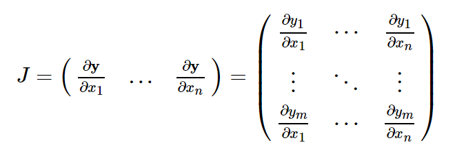
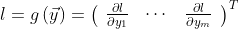

# torch.autograd

訓練神經網路(NN)有兩個步驟

> - 正向傳播: NN 對正確輸出進行最佳猜測。通過其每個函數運行輸入數據以進行猜測
> - 反向傳播: NN 根據其猜測中的誤差調整其參數。通過從輸出向後遍歷，收集有關函數參數(梯度)的誤差導數，並使用梯度下降來優化參數以實現。 可參考 3Blue1Brown series: https://www.youtube.com/watch?v=tIeHLnjs5U8

## 使用 autograd 的向量微積分 (2_autogradDerivative.py)

> - 若具有向量值函數 y = f(x)，則 y 相對於 x 的 Jacobi matrix J:
> - 
> - torch.autograd 是用於計算 Vector-Jacobi 積的引擎，換句話說就是給定任何的向量 v，計算乘積 J^T\*v
> - 若 v 恰好是 scalar 的梯度 
> - 根據 chain rule，Vector-Jacobi 積將是 l 相對於 x 的梯度:
> - 

## 計算圖

> - Autograd 由函數對象組成的有向無環圖(DAG)中記錄 tensor 和所有已執行的操作。在此 DAG 中，Leaf 為 input tensor，Root 為 output tensor。通過從 root to leaf 追蹤此圖，就可以使用 chain rule 自動計算梯度
> - 正向傳播中，Autograd 同時執行兩項操作
>   > - 運行請求的操作以計算結果 tensor
>   > - 在 DAG 中維護操作的梯度函數
> - 在 DAG 根上使用 backward()時，反向傳播開始
>   > - 從每個.grad_fn 計算梯度
>   > - 將它們累積在各自的 tensor's .grad attribute 中
>   > - 使用 chain rule，直至傳播至 Leaf tensor
> - **DAG 在 PyTorch 中是動態的**。
> - 圖是從頭開始創建的；在每個.backward()調用之後，Autograd 會開始填充新圖。

## 從 DAG 中排除(3_ExcludeFromDAG.py)

> - torch.autograd 追蹤所有將其 requires_grad 設置為 true 的 tensor 的操作。對於不需要梯度的 tensor，將此屬性設置為 false 就會從梯度計算的 DAG 中排除！
> - 即使只有一個輸入 tensor 具有 requires_grad = True，操作的輸出 tensor 也將需要梯度。
