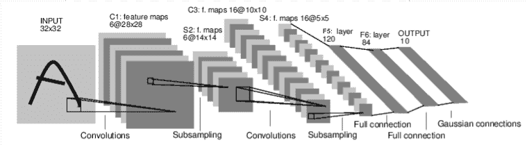

# Neural Network

- 使用 torch.nn 即可購建 Neural Network
- nn 依賴 autograd 來定義模型並對其微分
- nn.Module 包含 layer 以及返回 output 的方法 forward(input)
- 下圖為數字圖像進行分類的神經網路(LeNet.py)
  > - 
  > - 簡單的前饋網路，獲取輸入，將其一層又一層的饋入，最終給出輸出
- 神經網路的典型訓練過程：
  > - 定義具有一些可學習參數(或權重)的神經網路
  > - 遍歷輸入數據集
  > - 通過網路處理輸入
  > - 計算損失 (輸出正確的距離有多遠)
  > - 將梯度傳播回網路參數
  > - 使用簡單的更新規則更新網路的權重 ex: weight = weight - learning_rate \* gradient
  ## 定義網路(nn_definition.py)
  - 定義 forward 函數，就可使用 autograd 自動定義 backward 函數(計算梯度)
  - 可在 forward 函數中使用任何 tensor 操作
  - 回顧目前所看到的類型:
    > - torch.Tensor - 一個多維數組，支持諸如 backward()的自動微分操作。同樣，保持相對於 Tensor 的梯度
    > - nn.Module - 神經網路 Module。 封裝參數的便捷方法，並帶有可以將其移動到 GPU、導出、加載等的幫助。
    > - nn.Parameter - 一種 tensor，即將其分配為 Module 的屬性時，自動註冊為參數。
    > - autograd.Function - 實現自動微分操作的正向和反向定義。每個 Tensor 操作都會創建至少一個 Function 節點，該節點連接到創建 Tensor 的函數，並且編碼其歷史紀錄。

## Loss function(nn_lossFunction.py)

- 採用一對(輸入，目標)輸入，並計算其值，用來**估計輸出與目標之間的距離**
- torch.nn 有幾種不同的 loss function。最簡單的損失是 nn.MSELoss，計算輸入和目標之間的均方誤差。

## 更新權重(nn_updateWeight.py)

- implement 最簡單的更新規則是隨機梯度下降法(SGD)
  > - weight = weight - learning_rate \* gradient
- torch.optim 有各種不同的參數更新規則，例如: SGD、Nesterov-SGD、Adam、RMSProp 等
