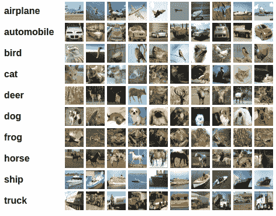

# Training a classifier

- For image, can use **Pillow, OpenCV** package
- For audio, can use **SciPy, librosa** package
- For text, can use **Python, Cython based loading or NLTK, SpaCy** package  
  針對視覺，可以用 torchvision，當中包含常見數據集( Ex: Imagenet, CIFAR10, MNIST etc. )的 data loader, 以及用於 image( e.g. torchvision.datasets and torch.utils.data.DataLoader )的數據轉換器

## 使用 CIFAR10 Dataset 進行練習(practiceCIFAR10.py)

- 具有以下類別：飛機、汽車、鳥、貓、鹿、狗、青蛙、馬、船、卡車。
- CIFAR10 中，圖像尺寸：3x32x32。意即是由 3 channels 的 32x32 pixels 的所組成的彩色圖像
  

## 訓練一個 image 的 classifier(practiceCIFAR10.py)

按照以下順序執行步驟：

1. 使用 torchvision 加載並標準化 CIFAR10 訓練和測試數據集
2. 定義卷積神經網路
3. 定義 loss function
4. 根據訓練數據訓練 NN
5. 在測試數據上測試網路
